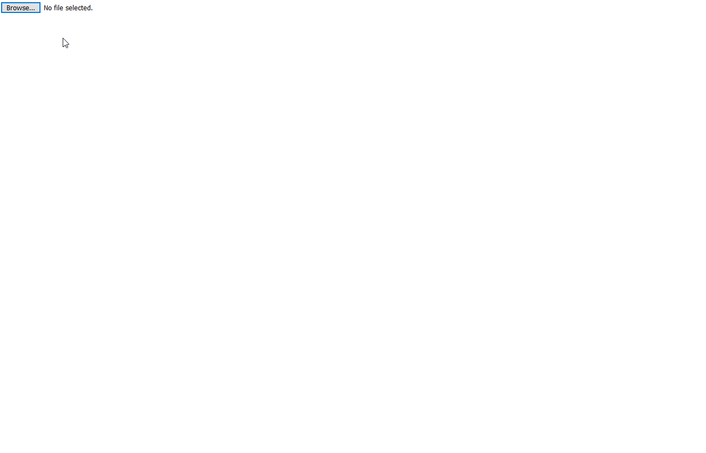
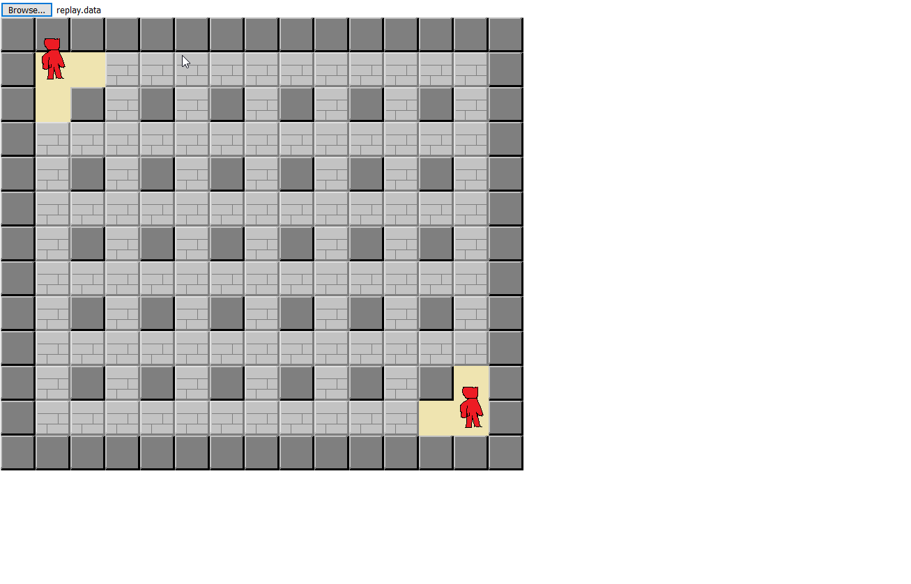

# bomber.ai

- servidor manda informações de:
  - mapa
  - posição dos bomber.ai
  - poderes do inimigo?

- armazena informações de:
  - localizações do mapa
  - gera mapa aleatorio
  - esconde os items/powers em baixo das paredes destrutiveis
  - algumas paredes são destrutiveis, outras nao.

- jogador pode possuir 1 ou mais personagens. ele pode tomar algumas ações, mas só uma por rodada:
  - andar para todas direções (se a direção for invalida, o movimento é cancelado e fica parado)
  - colocar bomba(se ja houver uma bomba no lugar o movimento é cancelado. Se não houverem bombas em estoque o movimento é cancelado).
  - arremessar bomba?
  - ficar parado

- aplicação web onde seja possivel pintar/assistir a partida

- bomba começa explodindo com raio de 2 casas de exploção 

</img>

- bomba leva 6 turnos para explodir

- partida deve ter um numero maximo de turnos. No final, quem tiver mais pontos vence a partida.

- jogo deve levar um score em consideração para que as partidas não terminem em empate
  - colocar uma bomba = 1pt
  - explodir um blobo = 2pt
  - pegar um power = xpt
  - acertar um bomber.ai = 50pt

- quando um bomber.ai é acertado ele deixa o campo de partida, uma vez que todos os bombers.ai de um player morrem ele imediatamente perde a partida.

- Primeiro o servidor irá executar os comandos de movimento. Depois as ações (colocar bomba/chutar bomba/jogar bomba) e por ultimo serão realizadas as explosões no mapa